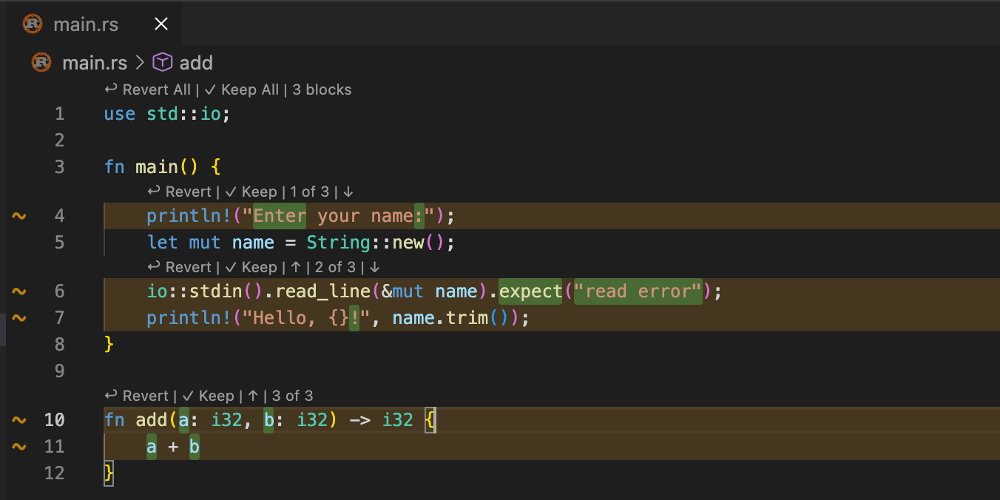
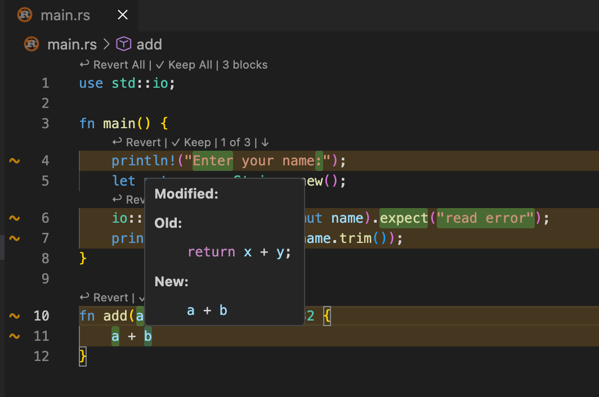
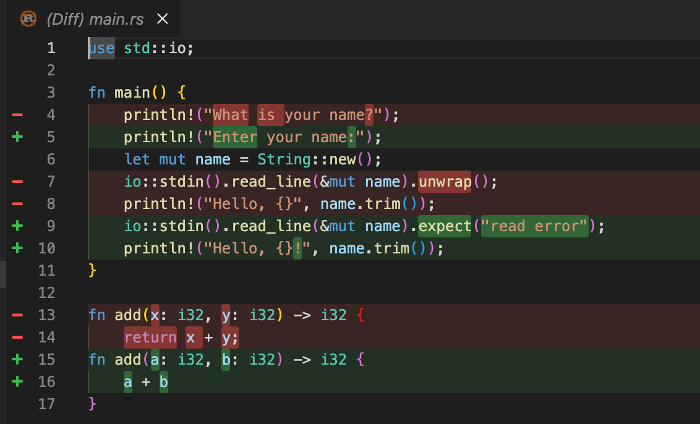
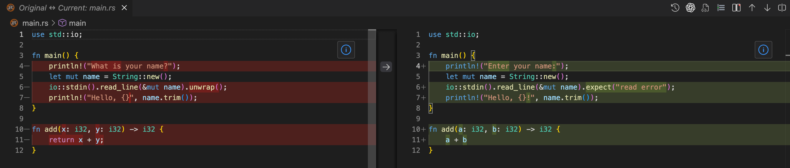

# Diff Tracker

Diff Tracker is a VS Code extension that records file changes and shows a Git-like inline diff directly in the editor.

## Screenshots

|               Editor Inline View                |    Editor Inline View (hover effect)    |
| :---------------------------------------------: | :-------------------------------------: |
|  |  |

| Inline View 2 | Side-by-side diff |
|:---------------:|:--------------:|
|  |  |

## Features

- Activity Bar view for tracked changes
- Recording mode to start and stop tracking
- Inline diff with added/removed highlights
- **Word-level diff highlighting** - precisely highlights changed words within modified lines
- Side-by-side diff on demand
- Hover details for deleted/modified content
- Multi-file tracking with timestamps
- Block-wise Revert/Keep buttons (like Cursor)
- File-level "Revert All" / "Keep All" CodeLens
- Revert per file or revert all
- Clear all tracked diffs
- Editor title buttons for inline and side-by-side diff
- Settings panel in sidebar to toggle display options

## Usage

1. Open the Diff Tracker view from the Activity Bar.
2. Click Start Recording.
3. Edit any file in your workspace.
4. Click a file in the left list to open the inline diff.
5. Use the editor title buttons to open:
   - Inline Diff (single-column)
   - Side-by-Side Diff
6. Use Revert File or Revert All as needed.
7. Click Clear Diffs to remove all tracked changes.
8. Click Stop Recording when you are done.

## How It Works

When recording starts, Diff Tracker:
1. Captures a baseline snapshot for files
2. Watches for content changes
3. Builds inline and side-by-side diffs
4. Updates the editor and the changes view in real time

## Installation

### From VSIX
1. Download the .vsix file
2. Open VS Code
3. Open Extensions (Cmd+Shift+X)
4. Click ... -> Install from VSIX...
5. Select the downloaded .vsix

### Development
1. Clone the repository
2. Run npm install
3. Run npm run compile
4. Press F5 to launch the Extension Development Host

## Requirements

- VS Code ^1.80.0

## Extension Settings

This extension provides the following settings (toggle via the sidebar Settings panel):

| Setting | Default | Description |
|---------|---------|-------------|
| `diffTracker.showDeletedLinesBadge` | `true` | Show a badge indicating deleted lines |
| `diffTracker.showCodeLens` | `true` | Show CodeLens actions (Revert/Keep) above change blocks |
| `diffTracker.highlightAddedLines` | `true` | Highlight added lines with green background |
| `diffTracker.highlightModifiedLines` | `true` | Highlight modified lines with blue background |
| `diffTracker.highlightWordChanges` | `true` | Highlight word-level changes within modified lines |

## Known Issues

None at this time. Please open an issue if you find a bug.

## Release Notes

### 0.1.0

- Activity Bar entry
- Recording mode for change tracking
- Inline diff highlighting
- Side-by-side diff
- Multi-file tracking with timestamps
- Revert file and revert all
- Clear diffs

### 0.2.0
- Change from LCS-based diff to Patience Diff algorithm for more intuitive diff display

### 0.3.0
- Add Partial Revert/Keep buttons, just like cursor
- Add go-to-original-file button in left panel

### 0.3.1
- Add file-level "Revert All" / "Keep All" buttons (CodeLens at file top)
- Add settings panel in sidebar to toggle display options
- Fix block-wise keep/revert affecting all blocks instead of just one
- Fix hover showing "unknown" for deleted empty lines

### 0.3.2
- Tiny bug fix

### 0.3.3
- Add word-level diff highlighting for modified lines
- Add "Highlight Word Changes" setting to toggle word-level highlighting

## License

MIT
